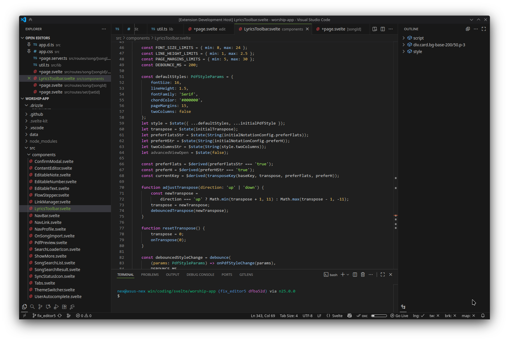
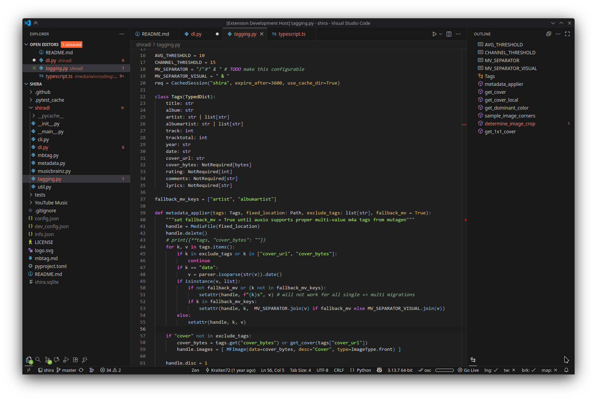

# Accord
A familiar, robust & well-thought-out theme.

  

## about
- Based on VS Code's [Dark Modern](https://github.com/microsoft/vscode/blob/main/extensions/theme-defaults/themes/dark_modern.json) theme
- [Base16 IR Black](https://base16.netlify.app/previews/base16-irblack) Syntax highlighting (extended)
- Green Apple (#7CB342) accent color  
  
## support further development
  
    
Any donations are highly appreciated!  

## more screenshots
  
  
  
## contributing
Please to report any issues with syntax higlighting

## credits
- thanks to [night-owl-vscode-theme](https://github.com/sdras/night-owl-vscode-theme) for the `demos/` (i edited them further afterwards)
- thanks to [one-hunter-vscode](https://github.com/Railly/one-hunter-vscode) for syntax higlighting scope sets
- thanks to VS Code's documentation: [Syntax Highlight Guide](https://code.visualstudio.com/api/language-extensions/syntax-highlight-guide)
  
I recommend you use the theme with the **Carbon Product Icons** (used in screenshots) - [repo](https://github.com/antfu/vscode-icons-carbon), [marketplace](https://marketplace.visualstudio.com/items?itemName=antfu.icons-carbon)