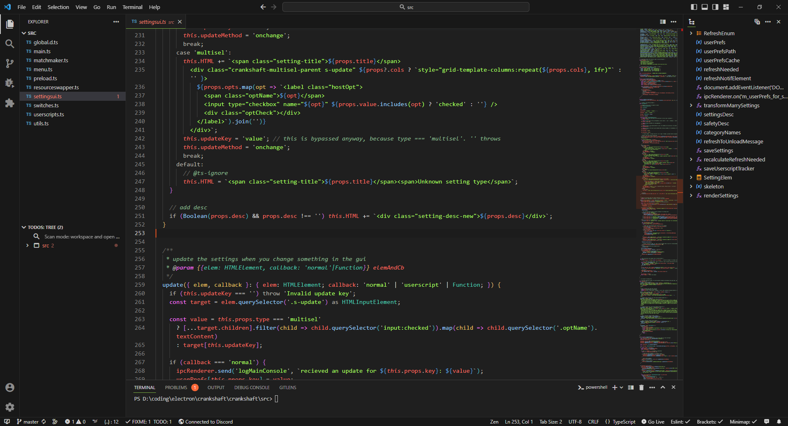
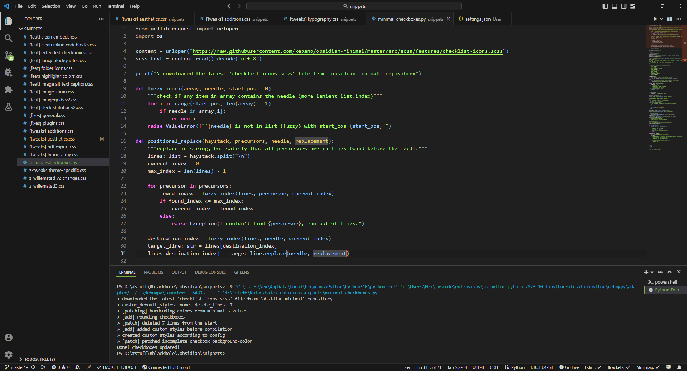
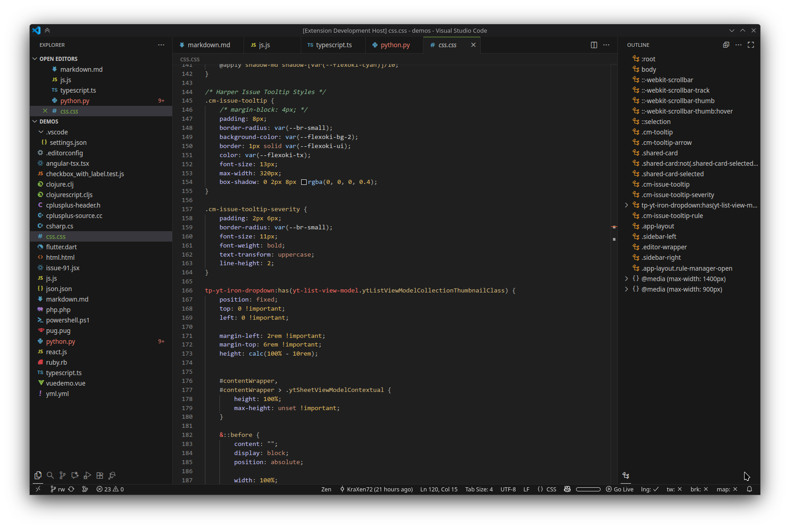
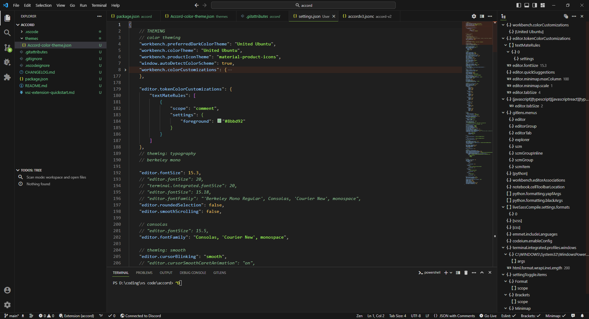

# Accord
> My theme for VSCode - KraXen72. It's not perfect but it's mine <3
  
  
Any donations are highly appreciated! <3

## about theme
This theme aims to be familiar, space efficient & robust.
- An assortment of grays for the backgrounds: dark-gray for side panels and a pleasing gray for main background.
- The syntax highlighting colors are from [United Ubuntu](https://github.com/rdnlsmith/vscode-linux-themes), a theme i've been using for ages & really like. 
- It has thin gray borders separating the screens & sharp corners, giving the theme a robust and stable feel

I recommend you use the theme with the **Material Product Icons** extension - [repo](https://github.com/PKief/vscode-material-product-icons), [marketplace](https://marketplace.visualstudio.com/items?itemName=PKief.material-product-icons)

It is based on the VSCode Dark, Dark+, Dark V2 Experimental and [United Ubuntu](https://github.com/rdnlsmith/vscode-linux-themes) themes. I added my fair bit of tweaks as well, mostly the apple green accent color. 

## contributing
I am aware that some keywords might not be properly highlighted, feel free to report these in the issues & i'll try to fix them.

## more screenshots

---

## credits
- thanks to [night-owl-vscode-theme](https://github.com/sdras/night-owl-vscode-theme) for the `demos/`
