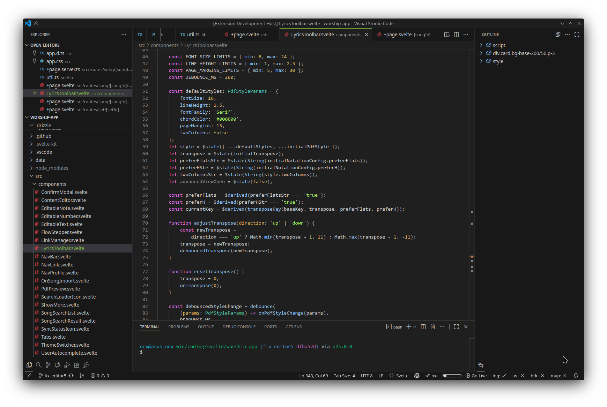
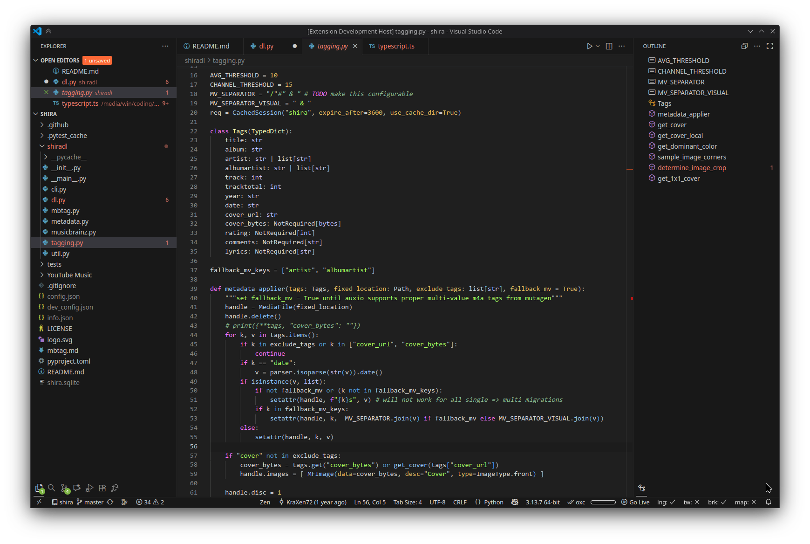
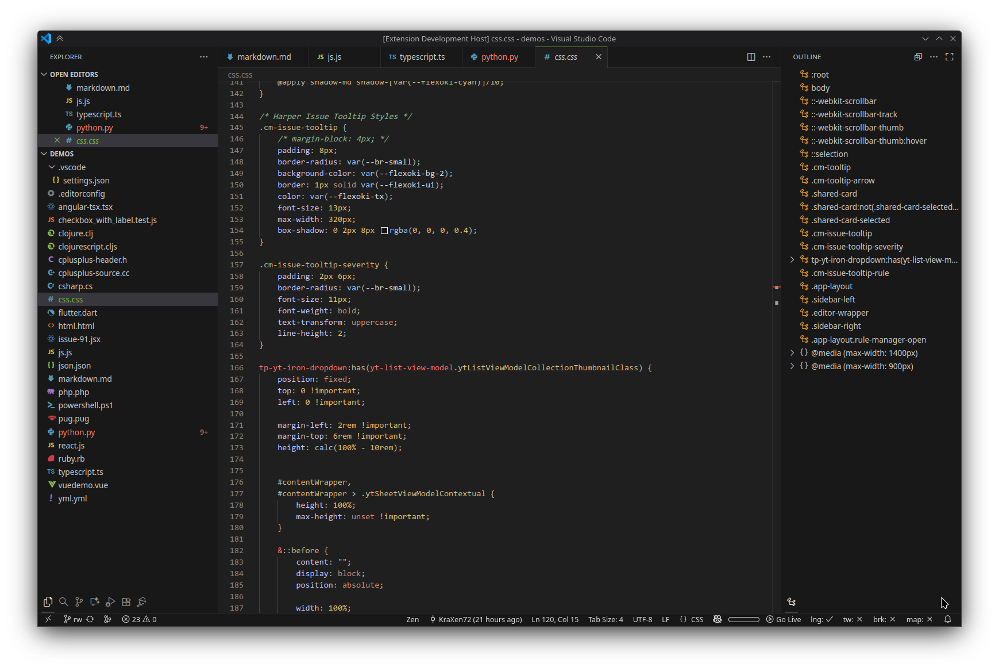
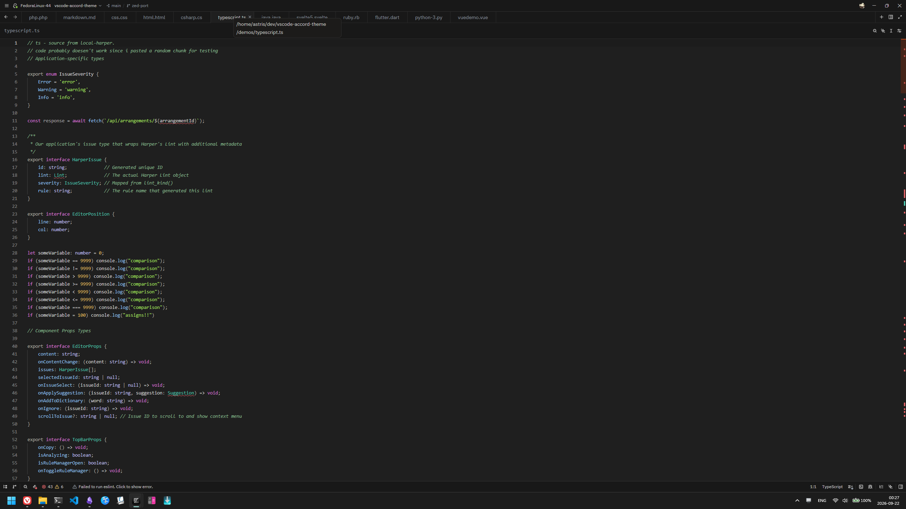
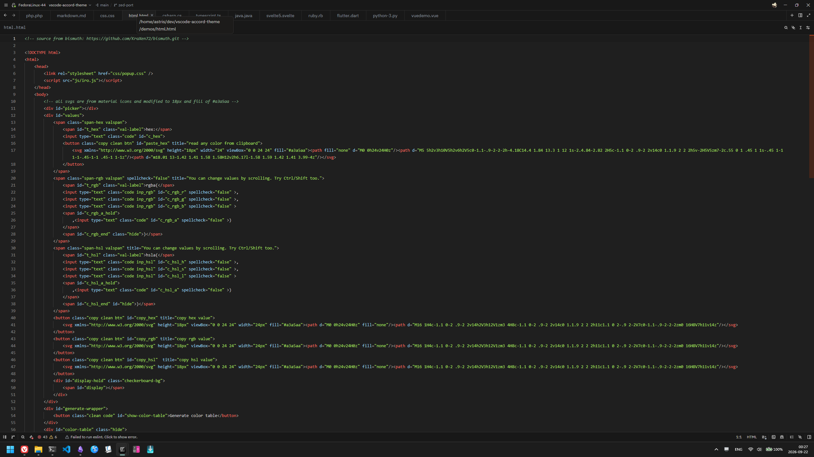
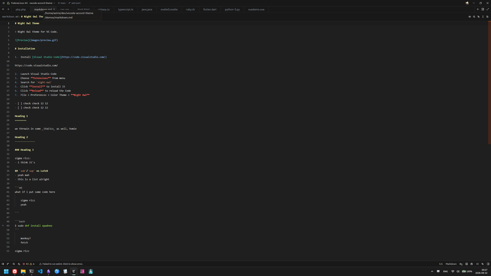

# Accord
A familiar, robust & well-thought-out theme.

  

## about
- Based on VS Code's [Dark Modern](https://github.com/microsoft/vscode/blob/main/extensions/theme-defaults/themes/dark_modern.json) theme
- [Base16 IR Black](https://base16.netlify.app/previews/base16-irblack) Syntax highlighting (extended)
- Green Apple (#7CB342) accent color  
  
## support further development
  
[](https://liberapay.com/KraXen72) [](https://ko-fi.com/kraxen72)   
Any donations are highly appreciated!  

## more screenshots
  
  
  
## contributing
Please to report any issues with syntax higlighting

## credits
- thanks to [night-owl-vscode-theme](https://github.com/sdras/night-owl-vscode-theme) for the `demos/` (i edited them further afterwards)
- thanks to [one-hunter-vscode](https://github.com/Railly/one-hunter-vscode) for syntax higlighting scope sets
- thanks to VS Code's documentation: [Syntax Highlight Guide](https://code.visualstudio.com/api/language-extensions/syntax-highlight-guide)
  
I recommend you use the theme with the **Carbon Product Icons** (used in screenshots) - [repo](https://github.com/antfu/vscode-icons-carbon), [marketplace](https://marketplace.visualstudio.com/items?itemName=antfu.icons-carbon)

## Zed

The repository also contains a native Zed extension. Install this directory with
**zed: install dev extension**, then select **Accord** in the theme selector.

The generated Zed theme is kept in sync with the VS Code source theme:

```sh
pnpm build:zed
pnpm test:zed
```

`build:zed` combines Accord syntax colors from `themes/Accord-color-theme.json`
with the vendored, MIT-licensed VSCode Dark Modern Zed UI baseline and writes
`themes/Accord-zed-theme.json`. `test:zed` checks the generated file against
Zed's v0.2.0 schema, verifies the non-syntax style exactly matches that pinned
baseline, verifies standard syntax capture coverage, and checks the demo corpus.

The baseline provenance and upstream license are in
`third_party/vscode-dark-modern/`.

### Zed previews






